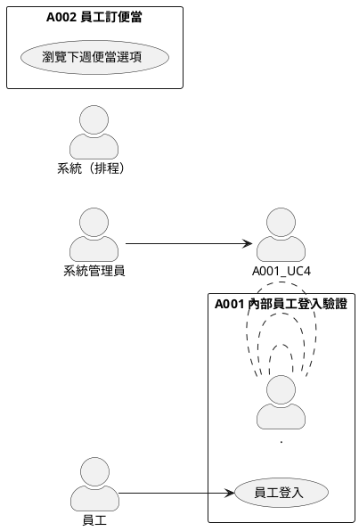

# sync-usecase

每當有新增需求或更改需求後，執行此指令以重新產出根目錄的 `usecase.puml`，統整所有需求的 Use Case。

## 執行步驟

1. 讀取 `index.md`，取得所有需求編號與標題
2. 依序讀取每個需求對應的 `output/{編號}/{編號}-usecase.puml`
3. 彙整所有需求的 actor 與 use case，產出根目錄的 `usecase.puml`
4. 格式規範：
   - 每個需求以獨立的 `rectangle` 區塊呈現，標題為「{編號} {需求標題}」
   - 所有 actor 統一定義在最外層，相同 actor 不重複宣告
   - 標籤、說明文字一律使用繁體中文

## 輸出格式範例

